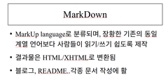
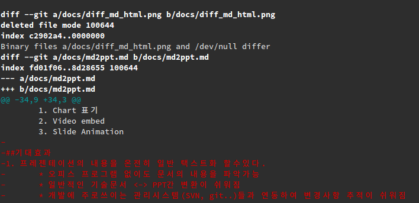

#마크다운 포맷을 활용한 프레젠테이션 조판 시스템

##구성

* 도형그리기
* Animation
* Image/Video embed

##Office Open XML
* MicroSoft에서 추진한 XML기반 국제 표준 문서규격
* 자사 office 프로그램에 활용됨
* library
	1. [Openxmllib](https://github.com/glenfant/openxmllib)  
		python 2.7기반 라이브러리, MS Office 2007,OpenOffice 2.2 지원
	2. [Open XML SDK](https://github.com/OfficeDev/Open-XML-SDK)  
		MicroSoft에서 공식 제공하는 C#기반 라이브러리, 최신버전 지원
		
## Markdown
* lv1
 * lv2
 * lv2
 1. or1
 2. or2
 3. or3 
1. asd
2. 123
3. 123
        
##기능구현
* Basic
	1. 제목
	2. Listing
	3. Image embed
    4. Template(.CSS)
* Advance I
	1. 표그리기
	2. Language Syntax 표현
* Advance II
	1. Chart 표기
	2. Video embed
	3. Slide Animation

##기대효과
1. 프레젠테이션의 내용을 온전히 일반 택스트화 할수있다.
	* 오피스 프로그램 없이도 문서의 내용을 파악가능
	* 일반적인 기술문서 <-> PPT간 변환이 쉬워짐
	* 개발에 주로쓰이는 관리시스템(SVN, git..)들과 연동하여 변경사항 추적이 쉬워짐
    
2. 기존 Markdown 사용자층을 끌어들일수 있을것으로 기대
