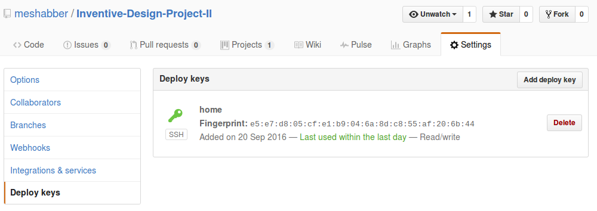

1. Generate SSH key
	* On Unix
	```bash
	$ ssh-keygen -t rsa -C "your_github_email@email.com"
	$ eval "$(ssh-agent -s)"
	$ ssh-add ~/.ssh/id_rsa

	$ $(xclip -selection clipboard) < ~/.ssh/id_rsa.pub
	```
	* On Windows

2. Add Key
	

3. Check
	```bash
	$ ssh -T git@github.com
	```
	```
	You've successfully authenticated, but GitHub does not provide shell access.
	```
